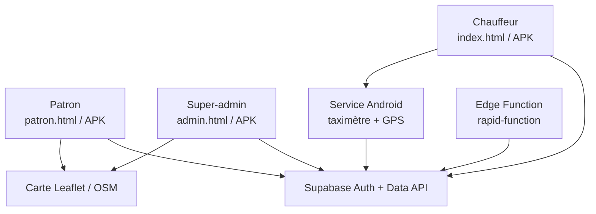
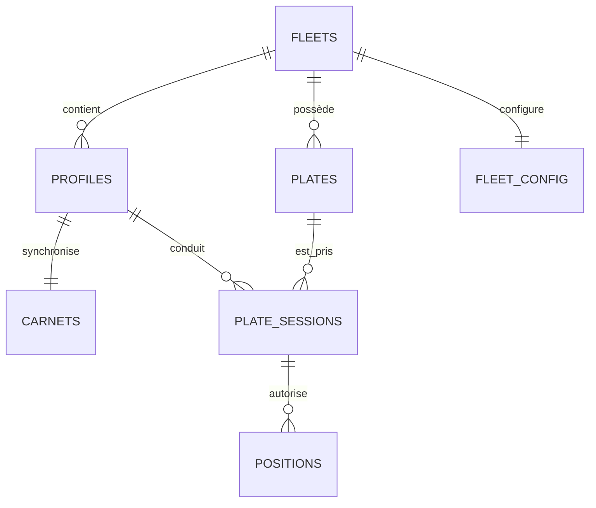

# Audit complet et état de préparation — Taxi Recettes

Date de clôture : 28 juillet 2026
Branche : `agent/full-ui-ux-overhaul`

## Verdict

Le code est désormais **compilable, testable et prêt pour une recette sur
téléphones réels**. Il n'est pas encore raisonnable d'encaisser de l'argent réel
tant que les trois actions de production suivantes ne sont pas terminées :

1. exécuter `supabase/INSTALLATION-COMPLETE.sql` sur le projet Supabase ;
2. redéployer l'Edge Function `rapid-function` ;
3. configurer une nouvelle clé de signature Android privée dans les secrets
   GitHub, puis réussir la recette à deux téléphones de
   `MISE-EN-PRODUCTION.md`.

La clé `service_role` n'a été ni demandée, ni lue, ni utilisée. Les tests
privilégiés ont été exécutés dans un Postgres WebAssembly jetable.

## 1. Cartographie



### Composants

| Composant | Responsabilité |
|---|---|
| `index.html` | Carnet chauffeur, mode invité, synchronisation hors-ligne, calculs, taximètre web et pont natif |
| `patron.html` | Plaques, chauffeurs, règlement patron/chauffeur, carte temps réel et trajet du jour |
| `admin.html` | Flottes, abonnements/options, comptes, carte globale et calculs |
| `dashboard.html` | Portail d'entrée vers les trois rôles |
| `android/` | Trois APK : chauffeur, patron et admin ; taximètre/GPS uniquement dans le flavor chauffeur |
| `supabase/*.sql` | Schéma, RLS, quotas, fonctions et permissions Data API |
| `supabase/functions/rapid-function` | Création, suspension, mot de passe et suppression de comptes |
| `.github/workflows/` | Tests, compilation, signature et publication des APK |

### Modèle de données



| Table | Donnée | Barrière principale |
|---|---|---|
| `fleets` | Flottes, suspension, options et quota de plaques | super-admin ou membre de la flotte non suspendue |
| `profiles` | Identité, rôle, flotte et statut actif | soi-même, patron de la flotte ou super-admin |
| `carnets` | Carnet JSON hors-ligne du chauffeur | propriétaire ; patron uniquement via `carnet_periode` |
| `plates` | Plaques d'une flotte | flotte courante |
| `plate_sessions` | Qui conduit quelle plaque et quand | chauffeur concerné, patron de la flotte ou super-admin |
| `positions` | Trace GPS, précision et heure de mesure | session correspondante + flotte + options GPS |
| `fleet_config` | Sources, retenues et carburant | patron de la flotte ; lecture chauffeur |

### Rôles

| Action | Chauffeur | Patron | Super-admin |
|---|---:|---:|---:|
| Modifier son carnet | oui | non | non |
| Lire une période de recette | soi | chauffeurs de sa flotte si option active | toutes les flottes |
| Prendre/rendre une plaque | soi | libération de sa flotte | toutes |
| Envoyer le GPS | soi, pendant sa session | non | non |
| Voir la carte | sa trace | sa flotte selon options | toutes |
| Modifier sources/retenues | non en flotte | sa flotte | toutes |
| Gérer les comptes | non | chauffeurs de sa flotte | tous |

## 2. Bugs confirmés et correctifs appliqués

### Bloquants

#### B1 — Installation Supabase neuve impossible

- **Reproduction :** exécuter les anciennes étapes à partir de l'étape 2 dans
  un projet neuf. Les tables `fleets`, `profiles`, `carnets` et la fonction
  `my_role` n'existaient pas.
- **Risque :** aucune installation reproductible ; corrections RLS impossibles
  à valider proprement.
- **Correctif :** ajout de `etape1-base.sql`, de `etape10-grants.sql` et d'un
  `INSTALLATION-COMPLETE.sql` ordonné et idempotent.
- **Preuve :** installation complète exécutée **deux fois** sans erreur ; sept
  tables et 24 policies présentes.

#### B2 — Ancienne clé de signature Android compromise par conception

- **Reproduction :** le workflow supprimé `gen-keystore.yml` créait un keystore
  avec alias et mots de passe constants, puis le commitait dans Git.
- **Risque :** toute personne ayant lu l'historique pouvait signer une fausse
  mise à jour.
- **Correctif :** suppression du workflow, exclusion des keystores, signature
  uniquement depuis quatre secrets GitHub, validation du keystore avec
  `keytool` avant build.
- **Action restante :** créer une **nouvelle** clé privée ; ne jamais réutiliser
  celle de l'historique.

### Majeurs — argent réel

#### M1 — Montants et kilomètres français mal interprétés

- `"1.000"` pouvait devenir 1 € au lieu de 1 000 €.
- `"125480,7"` pouvait devenir 1 254 807 km, donc multiplier le carburant.
- **Correctif :** parsing explicite des milliers, virgules et décimales ;
  bornes de cohérence.

#### M2 — Écart d'arrondi entre chauffeur et patron

- **Reproduction :** retenues fréquentes de 25 %, 30 % ou 33 % sur des montants
  tombant au demi-centime.
- **Risque :** le flottant JavaScript arrondissait certains cas dans un sens
  différent.
- **Correctif :** calcul en centimes entiers dans `rideNet`, `cRideNet` patron
  et `cRideNet` admin.
- **Preuve :** les trois fonctions sont extraites de leurs fichiers HTML et
  comparées sur **100 000 courses aléatoires : zéro écart**.

#### M3 — Total affiché potentiellement différent des lignes

- **Correctif :** arrondi de chaque ligne au centime, puis même stratégie pour
  les agrégats.
- **Preuve :** 10 000 groupes aléatoires ; total affiché égal à la somme des
  lignes dans tous les cas.

#### M4 — Course du taximètre ajoutée au mauvais jour

- **Reproduction :** consulter une ancienne date, lancer une course, puis
  l'ajouter au carnet.
- **Risque :** l'ancien jour était rouvert et crédité, avec contournement
  possible du verrou de plaque.
- **Correctif :** une course va toujours vers la journée réellement active ou
  la date courante.

#### M5 — Minimum et supplément de nuit incorrects

- Le saut de compteur pouvait ramener le prix final sous le minimum.
- Le supplément Bruxelles présent dans la configuration n'était jamais ajouté.
- **Correctif :** saut puis minimum, dans le même ordre web/Android ; supplément
  non-réservé appliqué entre 22 h et 6 h et persisté après kill Android.
- **Preuve :** 50 000 configurations de compteur, aucun montant sous le minimum
  et parité web/native.

#### M6 — Saut GPS facturé comme une distance réelle

- **Reproduction :** deux points précis en apparence, séparés par une
  téléportation GPS.
- **Risque :** kilomètres et prix fictifs.
- **Correctif :** point ignoré au-delà de 180 km/h, côté web et Android ;
  précision maximale paramétrable et bornée.

### Majeurs — synchronisation hors-ligne

#### M7 — Un deuxième téléphone pouvait effacer les courses du premier

- **Reproduction :** A et B lisent la même version ; A pousse une course ; B
  pousse ensuite depuis son ancienne copie.
- **Cause :** mise à jour aveugle et comparaison avec la dernière frappe locale,
  pas avec le dernier échange serveur.
- **Correctif :** compare-and-swap sur `updated_at`, détection `stale`, union
  par identifiant et horodatage monotone.
- **Preuve :** scénario exécuté dans Node avec deux stockages et un faux
  PostgREST ; les trois courses restent présentes.

#### M8 — Plusieurs chemins perdaient une saisie locale

- reset après données corrompues qui poussait un carnet vide ;
- quota `localStorage` plein laissant une course seulement en RAM ;
- backup non vérifié avant déconnexion/changement de compte ;
- login hors-ligne remplaçant ensuite la saisie par le carnet serveur ;
- suppression ressuscitée depuis un autre appareil.
- **Correctifs :** échec fermé, backup vérifié, déconnexion annulée si le backup
  échoue, état `unverified`, tombstones et fusion par champ/ID.
- **Preuve :** tests automatisés de login hors-ligne, quota plein, tombstone,
  recul d'horloge et invariant
  `non-synchronisé ⇔ localUpdatedAt > lastSyncedAt`.

#### M9 — Trace GPS native perdue ou figée

- Le jeton expirait pendant une longue course.
- Une coupure réseau perdait les points intermédiaires.
- Arrêter le compteur effaçait la file avant son envoi.
- Rendre la plaque empêchait de rejouer les points mesurés durant la session.
- **Correctif :** refresh token natif, file privée de 480 points, envoi par lots,
  reprise à l'ouverture, arrêt de collecte sans effacement, et RLS autorisant
  uniquement les points compris dans la vraie plage de session.
- **Preuve :** compilation Kotlin, contrôle SQL d'un point rejoué après clôture
  de session, refus d'un point hors session.

### Majeurs — sécurité et multi-location

#### M10 — Portée de mise à jour de profil trop large

- **Reproduction :** un patron autorisé à mettre à jour un chauffeur pouvait
  forger un PATCH sur l'identifiant technique ou le rattachement.
- **Correctif :** trigger `profile_scope_lock` ; le patron peut changer les
  champs métier permis, pas l'identité, le rôle ni la flotte.
- **Preuve :** tentative patron refusée ; modification du nom d'affichage
  autorisée.

#### M11 — Fonctions privilégiées et accès anonyme

- Les fonctions `SECURITY DEFINER` devaient vérifier elles-mêmes rôle, flotte,
  compte actif, suspension et période.
- Supabase peut accorder `EXECUTE` à `PUBLIC` par défaut.
- **Correctif :** `search_path` fixé, garde complète dans `carnet_periode`,
  période maximale de 92 jours, révocations explicites `PUBLIC, anon`.
- **Preuve locale :** lecture anonyme refusée ; fuite inter-flotte, élévation de
  rôle et lecture du carnet d'une autre flotte refusées.
- **État production lu avec la clé publique :** six tables sur sept renvoient
  401 ; `carnets` renvoie actuellement `[]` sans fuite. L'étape 10 doit encore
  être déployée pour obtenir un refus 401 explicite partout.

#### M12 — Pont natif WebView accessible après navigation externe

- **Reproduction :** l'app chauffeur injectait `TaxiNative`, mais la WebView ne
  verrouillait pas sa navigation. Une page externe ouverte dans cette WebView
  aurait conservé le pont.
- **Correctif :** `WebViewAssetLoader` sous origine HTTPS interne, allowlist de
  navigation, liens externes envoyés au navigateur, `file://` et HTTP clair
  interdits, backup Android désactivé.
- **Preuve :** test statique dédié, manifestes fusionnés et Android Lint ;
  le pont n'existe que dans le flavor chauffeur.

#### M13 — Compte désactivé ou flotte suspendue encore exploitable

- **Correctif :** `my_role`, `my_fleet`, `my_role_sd`, RLS et Edge Function
  vérifient le statut actif et la suspension. Un patron suspendu ne crée plus de
  chauffeur.

### Mineurs et robustesse

- réponses réseau obsolètes ignorées grâce à des numéros de requête ;
- enregistrement des réglages bloqué si leur chargement a échoué ;
- nouveaux mots de passe à dix caractères minimum, saisie masquée et détails
  d'erreur internes conservés uniquement dans les logs Edge Function ;
- `pg_cron` optionnel ne fait plus échouer toute l'installation ;
- coordonnées, précision et dates GPS bornées côté SQL ;
- impossible de clôturer la journée ou rendre la plaque pendant un taximètre
  actif ;
- APK patron/admin limitées à `INTERNET`, sans GPS, overlay ni service de
  localisation ;
- PWA installable et coque chauffeur disponible après un premier chargement
  hors-ligne ;
- workflow qualité sur chaque Pull Request.

## 3. Refonte UI/UX livrée

La refonte ne se limite pas à des couleurs :

- nouveau portail des rôles ;
- trois postes de travail distincts : cockpit chauffeur, centre opérationnel
  patron et console réseau super admin ;
- navigation latérale sur ordinateur et navigation basse sur mobile ;
- typographie IBM Plex Sans et chiffres tabulaires ;
- identité bleu nuit + jaune taxi, avec bleu pour le patron et violet pour le
  super admin ;
- cibles tactiles d'au moins 44 px ;
- résumé chauffeur net/courses/km et accès direct au taximètre ;
- raccourci patron vers le traceur GPS dès l'écran d'accueil ;
- formulaires de règlement regroupés dans l'ordre réel du travail ;
- résultat de règlement maintenu visible ;
- réglages du taximètre bornés et supplément de nuit clairement affiché ;
- cartes GPS sous forme de traceur : liste des véhicules, âge du point,
  précision en mètres, cercle d'incertitude, trace récente, centrage sur un
  chauffeur et replay du trajet du jour ;
- échappement des textes dynamiques et rejet des réponses concurrentes tardives.
- cache PWA versionné pour remplacer l'ancienne interface sur les appareils
  déjà installés.

Important : une application ne peut pas rendre un GPS plus précis que le
capteur. L'interface indique donc honnêtement le rayon d'incertitude et l'âge du
point au lieu d'afficher une fausse précision.

## 4. Tests réellement exécutés

| Test | Résultat |
|---|---|
| Syntaxe JavaScript de cinq pages, dont l'asset Android | OK |
| Manifest PWA, service worker et icônes | OK |
| Asset chauffeur Android identique à `index.html` | OK |
| `rideNet` vs `cRideNet` patron/admin | 100 000 / 100 000 OK |
| Somme des lignes vs total affiché | 10 000 / 10 000 OK |
| Taximètre web/native | 50 000 / 50 000 OK |
| Deux téléphones + faux PostgREST | aucune course perdue |
| Login hors-ligne puis retour réseau | fusion OK |
| Quota plein | déconnexion bloquée, saisie conservée |
| Suppression multi-appareil | pas de résurrection |
| Migrations complètes | 2 passages successifs OK |
| Tables/policies | 7 tables, 24 policies |
| Isolation de deux flottes | OK |
| Lecture anonyme locale | refusée |
| Rôle/identité forgés | refusés |
| GPS impossible, futur ou hors session | refusé |
| Rejeu GPS hors-ligne dans la session | accepté |
| Trois APK debug, build propre | OK |
| Trois APK release non signées, build propre | OK |
| Android Lint Vital release | aucun problème |
| Permissions fusionnées | patron/admin = Internet seulement |
| API production avec clé anonyme | aucune donnée retournée |

Commandes reproductibles :

```bash
npm ci
npm test
cd android
gradle clean assembleDebug assembleRelease
```

Les APK release locales sont volontairement non signées. Le workflow GitHub
produit les APK signées uniquement lorsque les quatre secrets privés sont
présents.

## 5. Ce qui manque encore au système, par priorité

### P0 — avant argent réel

1. Déployer SQL + Edge Function + nouvelle signature, puis suivre la recette
   physique de `MISE-EN-PRODUCTION.md`.
2. Comparer plusieurs courses avec un taximètre homologué dans un vrai taxi.
   Le compteur de l'app reste un outil d'appoint ; Bruxelles exige le matériel
   homologué et le ticket réglementaire.
3. Tester au minimum un Android standard et un appareil agressif en économie
   d'énergie (MIUI/HyperOS), écran verrouillé et réseau coupé.
4. Écrire une procédure de sauvegarde/restauration Supabase et tester une
   restauration, pas seulement la sauvegarde.

### P1 — prochaine évolution structurante

1. Remplacer progressivement le gros JSON `carnets` par un **journal append-only**
   de courses/charges en centimes, avec clé d'idempotence. C'est la meilleure
   protection à long terme pour l'argent et la concurrence multi-appareil.
2. Ajouter un journal d'audit immuable des changements de rôle, flotte, taux,
   suppression de compte et réglages.
3. Séparer `staging` et `production` Supabase ; ne jamais tester une migration
   directement en production.
4. Ajouter alertes : échec Edge Function, GPS figé, file GPS pleine, conflit de
   synchronisation, purge inactive et échec de workflow.
5. Activer une authentification plus forte pour patrons/admins : MFA, politique
   de mot de passe et récupération documentée.

### P2 — qualité et maintenance

1. Découper les trois gros fichiers HTML en modules et composants testables.
2. Ajouter des tests instrumentés Android sur appareil/emulateur pour kill du
   process, Doze, rotation, permissions refusées et WebView.
3. Ajouter un worker réseau Android pour vider la trace sans attendre la
   prochaine ouverture de l'app.
4. Formaliser confidentialité/RGPD : durée de conservation, information du
   chauffeur, droit d'accès et journal du consentement.

## 6. Sources réglementaires et techniques

- Tarifs et obligations taxi Bruxelles :
  https://be.brussels/fr/transport-mobilite/transport-en-commun/taxi-et-mobilite-partagee/prendre-un-taxi
- Sécurisation des fichiers dans une WebView :
  https://developer.android.com/privacy-and-security/risks/webview-unsafe-file-inclusion
- `WebViewAssetLoader` :
  https://developer.android.com/reference/androidx/webkit/WebViewAssetLoader
